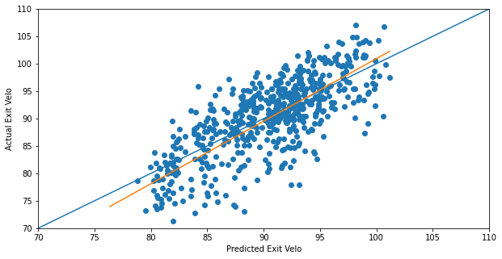
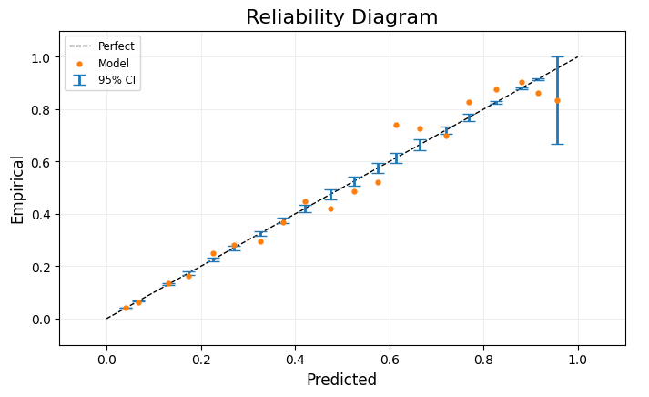

## Contact Information
Email: toddkawahara@hotmail.com

[LinkedIn](https://www.linkedin.com/in/todd-kawahara/)

[Twitter](https://twitter.com/toddkawahara)

## Education
M.S. Business Analytics | University of Massachusetts-Amherst '23

B.S. Mathematics, B.S. Economics (Honors) | Trinity College '22
## Projects
### <ins>[Expected Bat Speed from Biomechanical Data](https://toddkawahara.wordpress.com/2023/09/10/expected-bat-speed-from-biomechanical-data/)<ins>
[Notebook](https://github.com/toddkawahara/expected-bat-speed/blob/main/Predicting_Bat_Speed.ipynb)
- Point 1
- Point 2
- Point 3

### <ins>[Predicting Hitter Exit Velocity: The Importance of Bat Speed](https://toddkawahara.wordpress.com/2023/01/10/predicting-hitter-exit-velocity-the-importance-of-bat-speed/)<ins>
[Notebook](https://github.com/toddkawahara/predicted-exit-velocity/blob/main/Driveline_Hitting.ipynb)
- Point 1
- Point 2
- Point 3

### <ins>[Using Machine Learning to Determine What Pre-Existing Factors Put Individuals at High Risk to Covid-19](https://toddkawahara.wordpress.com/2023/01/26/using-machine-learning-to-see-what-pre-existing-factors-put-individuals-at-high-risk-to-covid-19/)<ins>
[Notebook](https://github.com/toddkawahara/covid-hospitalizations/blob/main/Covid.ipynb)
- Obtained a dataset of over 1 million hospital patients from the Mexican government and their pre-existing conditions. Cleaned the dataset by selecting only patients that test positive for Covid-19, removing null/missing entries, and fixing pregnancy entries for males
- Performed explatory data analysis and discovered that Covid positive patients who previously had pneumonia were hospitalized more often than any other condition
- Tested a Logistic Regression, Random Forest Classifier, XGBoost Classifier, LightGBM Classifier, and CatBoost Classifier before focusing on the LightGBM model and tuning its hyperparameters using grid searches
- Calibrated the model's probabilities and evaluated it using an AUC ROC Curve (0.896), confusion matrix (accuracy: 0.956, recall: 0.648), log loss (0.154), and brier score (0.038)
- Utilized SHapley Additive exPlanations (SHAP) to generate feature importance and discover that individuals who previously had pneumonia or were in certain age groups were more likely to be hospitalized from Covid-19

