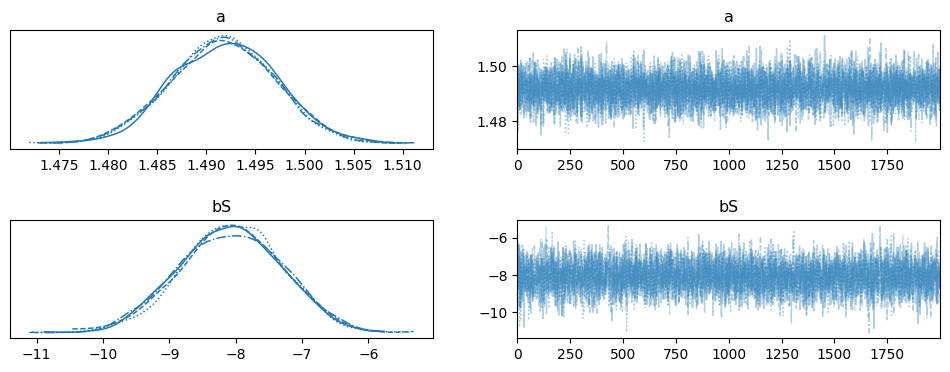
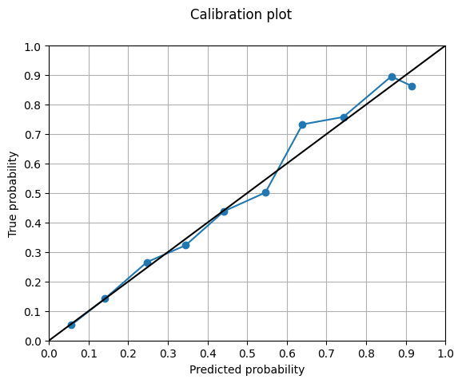

## Contact Information
toddkawahara@hotmail.com | [GitHub](https://github.com/toddkawahara) | [LinkedIn](https://www.linkedin.com/in/todd-kawahara/) | [Twitter](https://twitter.com/toddkawahara)

## Work Experience
Baseball Analytics Trainee (Data Science) | Cincinnati Reds | Feb 2024 - Nov 2024

Statistical Data Analyst | Olin Business School at Washington University in St. Louis | Jun 2023 - Jan 2024
## Education
M.S. Business Analytics | University of Massachusetts-Amherst '23

B.S. Mathematics, B.S. Economics (Honors) | Trinity College '22
## Personal Projects
### <ins>[Attempting to Model Inning Outcomes Using Stuff: A Bayesian Approach](https://medium.com/@toddkawahara/attempting-to-model-inning-outcomes-using-stuff-a-bayesian-approach-8f6784241dfd)<ins>
[Notebook](https://github.com/toddkawahara/outing_predictions/blob/main/outing_predictions%20(1).ipynb)
- Built personal Stuff model to generate expected run values for each pitch in the 2024 season
- Tested between different distributions and hierarchical model structures for the likelihood function
- Examined prior predictive simulation distribution to verify that priors were sensible
- Utilized Hamiltonian Monte Carlo to perform inference, inspected trace plots to ensure convergence of chains
- Evaluated model performance using normalized log posterior predictive density

### <ins>[Expected Bat Speed from Biomechanical Data](https://medium.com/@toddkawahara/expected-bat-speed-from-biomechanical-data-ecf5620e110e)<ins>
[Notebook](https://github.com/toddkawahara/expected-bat-speed/blob/main/Predicting_Bat_Speed.ipynb)
- Created an expected bat speed model to see how bat speed could be trained, worked with elite-level baseball hitters' biomechanical data from [The OpenBiomechanics Project](https://www.openbiomechanics.org/) by Driveline Baseball Research and Development
- Tested how a changing threshold of correlations to remove in the feature set affected RMSE and the slope of the line of best fit between the predicted and actual bat speeds for a Linear Regression, Ridge Regression, and XGBoost Regression
- Graphed learning curves to see how the Ridge and XGBoost Regressions were learning before tuning them using the Optuna package, minimizing RMSE
- Generated predicted bat speeds with an RMSE of 2.77 MPH from the XGBoost Regression and analyzed the model's feature importance to reveal that pelvis angular velocity was by far the most important factor in predicting bat speed
- Plotted the relationship between pelvis angular velocity and bat speed to observe a statistically significant linear relationship (p=0.00) with a positive correlation (Pearson: 0.261) between the two variables

### <ins>[Predicting Hitter Exit Velocity: The Importance of Bat Speed](https://medium.com/@toddkawahara/predicting-hitter-exit-velocity-the-importance-of-bat-speed-6d59a25d368c)<ins>
[Notebook](https://github.com/toddkawahara/predicted-exit-velocity/blob/main/Driveline_Hitting.ipynb)
- Utilized elite-level baseball hitters' biomechanical data from [The OpenBiomechanics Project](https://www.openbiomechanics.org/) by Driveline Baseball Research and Development to predict the exit velocity of a hitter's swing.
- Conducted feature engineering to create feature meant to capture skills not directly captured by the dataset (bat-to-ball skills)
- Examined how a Linear Regression, Random Forest Regression, and XGBoost Regression did with different feature sets before selecting the Random Forest Regression and one feature set to tune using grid searches
- Generated predictions from the tuned model to get an RMSE of 4.51 MPH, also evaulated by plotting the distribution of the predicted exit velocities against the actual exit velocities
- Analyzed the Random Forest Regression's feature importance to see that bat speed was the biggest factor in the feature set in predicting a hitter's exit velocity

### <ins>[Using Machine Learning to Determine What Pre-Existing Factors Put Individuals at High Risk to Covid-19](https://medium.com/@toddkawahara/using-machine-learning-to-determine-what-pre-existing-factors-put-individuals-at-high-risk-to-faeda950795c)<ins>
[Notebook](https://github.com/toddkawahara/covid-hospitalizations/blob/main/Covid.ipynb)
- Obtained a dataset of over 1 million hospital patients with various pre-existing conditions from the Mexican government. Cleaned the dataset by selecting only patients that tested positive for Covid-19, removing null/missing entries, and fixing pregnancy entries for males
- Performed explatory data analysis and discovered that Covid positive patients who previously had pneumonia were hospitalized more often than any other condition
- Tested a Logistic Regression, Random Forest Classifier, XGBoost Classifier, LightGBM Classifier, and CatBoost Classifier before focusing on the LightGBM model and tuning its hyperparameters using grid searches
- Calibrated the model's probabilities and evaluated them using an AUC ROC Curve (0.896), confusion matrix (accuracy: 0.956, recall: 0.648), log loss (0.154), and brier score (0.038)
- Used SHapley Additive exPlanations (SHAP) to generate feature importance and discover that individuals who previously had pneumonia or were in certain age groups were more likely to be hospitalized from Covid-19

